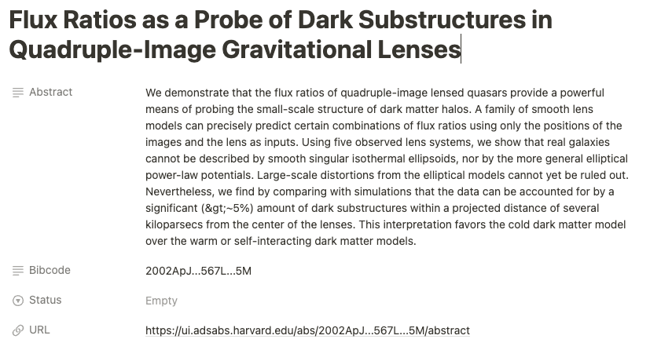
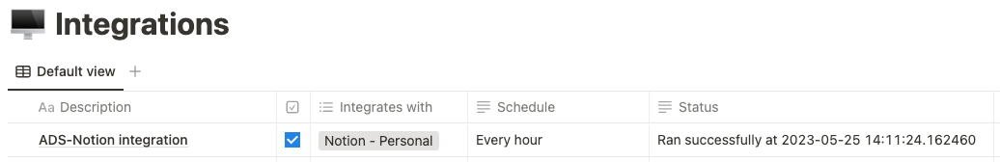

# Integration between SAO/NASA Astrophysics Data System and Notion

Queries ADS for papers saved in a particular library and creates corresponding database entries with relevant metadata in Notion

## Configuration notes
- Create database in Notion for ADS papers with properties
  - Abstract (Text)
  - Bibcode (Text)
  - URL (URL)


- Create database in Notion to manage integration with properties
  - Active (Checkbox)
  - Status (Text)



- Make sure the integration user has the appropriate permissions for these pages
- Create `constants_ads_notion_integration.json` in script directory that looks like
```
{
  "ads_token": "----ADS API token----",
  "ads_library_name": "----ADS library name----",
  "notion_api_token": "secret_---------------------",
  "notion_api_version": "2022-06-28",
  "integration_page_id": "------------------------",
  "research_papers_page_id": "------------------------"
}
```
where Notion page IDs can be retrieved from their URLs

- Update `is_active_in_notion()` method of `notion_helper.py` with the appropriate property item id which can be retrieved from the [retrieve a page endpoint](https://developers.notion.com/reference/retrieve-a-page)

Parts of this code, where indicated, are adapted from [adsabs/ads-examples](https://github.com/adsabs/ads-examples/blob/master/library_csv/lib_2_csv.py)